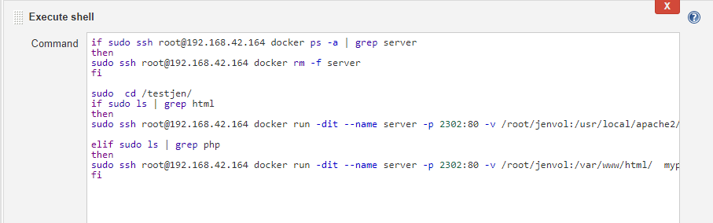

**DevOps Project 2 :**

Step - 1: I have created a container image that has Jenkins installed using Dockerfile.

The commands in Dockerfile are as follows--

I have used Centos latest version. We need to install sudo & wget because they will be furthur needed in the installation of Jenkins. Then we have installed Jenkins & the suitable jdk version. 
Since systemctl doesn't work in Centos, so we would require to use _**sudo service jenkins start**_ command. But service command isn't avvailable in Centos latest image. So, we have installed _**/sbin/service**_
We have also installed git because we'll need it later. The third last line is to give powers to jenkins to perform operations inside the container.
The, we have started the Jenkins by _**sudo service jenkins start**_ but we also need to start _**/bin/bash**_ otherwise the container will close as soon as jenkins starts because there will be no tasks left. Hence, we also start the bash in same coomand.

**Note : The bash has to be started in the same command because if there are more than one commands in the Dockerfile, then only the last command runs.**

After that, we have exposed Port 8080 because Jenkins runs on port 8080.

Step - 2: Now, we move on to our Jenkins tasks.

**TASK 1 : Production**
  In this task, the code will be auto downloaded from Github. For this, I have used trigger method. 
  
  
  
  
  
  
  The trigger would work and I have provided the link along with the authentication token to my local git. As soon as any code is    pushed, Git hook would work & run this task automatically.
  In the execute shell section, The webpages are being downloaded to this folder inside the container.
  
  
  
  **TASK 2 : Transfer**
   In this task, the web pages downloaded inside the container are being transferred to the base Redhat using scp. I have already   authorized a ssh key from my container to Redhat.
   
   
   
   
   **TASK 3 : Deployment**
   In this task, the file type is checked by checking the extension. Like if the pages are build in html, the extension of the file would be .html, then the code would detect and launch an httpd server to deploy the pages. If the pages are build in php, the extension of the file would be .php, then a php supporting container would be deployed. 
   I have checked just 2 types - html & php but you can add more depending upon your requirements.
   The suitable container will auto launch and the code will be auto deployed.
   
   
   
   
   
   
   
   
   **TASK 4 : Testing**
    In this task, the deployed code would be tested and if there is any error, an email will be automatically sent to the mentioned emails. For this, I have used the status method, i.e. , whenever we access any web page using curl and linux, the status is 200 if the page is working, otherwise not. So, I have segregated the status annd used it in my concept. The exit 1 would deliberately fail the task.
    
   
    
   
    
   
    
   If your email isn't working, you need to go to Jenkins configuration and do the following setup.
   
   
   
   
   If you are still facing any errors in email, go to your jenkins container &  run ---
   
   
   In that file, in the **JENKINS_JAVA_OPTIONS='   "**, make the following changes :
   
   
   
   **TASK 5 : Monitoring**
        
 In this task, I have checked if the container is working fine. If the container exists, the task will fail due to exit 1. If the container is not running, the task will give a success signal. As soon as this task will succeed, the above mentioned deployment task will be auto triggered to deploy the containers. 
         
   
   
   
   
   
   Viola !! The system is ready to use.
    
    

